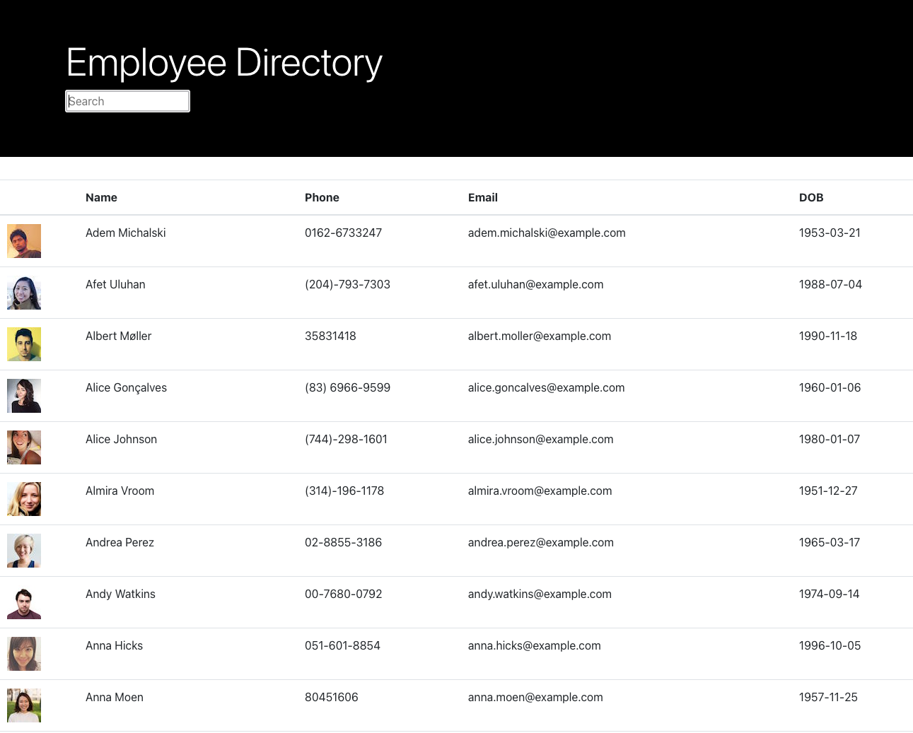

# Title: Employee Directory

Created By: Samantha Peloquin

> Deployed Application: https://zen-volhard-4c8149.netlify.app/

## Table of Contents

- [Project Description](#description)
- [Installation Details](#installation)
- [Usage](#usage)
- [Interface](#Interface)
- [Questions](#questions)

## Description

---

> Using an API call a to randomuser, this application displays a table of 100 employees. These employees can be searched and displayed alphabetically by clicking on the "Name" header.

## Installation

---

> Instructions: npm start
>
> _To begin install please head on over to the repo found in the [Questions](#questions) section of this README_

## Usage

---

> An application like this can be used to search and organize data at the click of the mouse.

## Interface

---

## Questions

---

> _If you have any questions at all please don't hesitate to review the repo or email me directly_
>
>  > 
